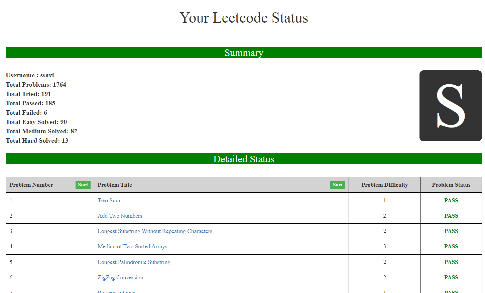

# Leetcode-Scrapper
Leetcode-Scrapper is a JSON based scrapper for Leetcode approached problems of an user. Like this -



To work with this repository follow the steps below.

# Step 1
Clone this repository using -
``` git clone https://github.com/Bishalsarang/Leetcode-Questions-Scraper.git ```

or download the zip by clicking [here](https://github.com/Bishalsarang/Leetcode-Questions-Scraper/archive/refs/heads/master.zip).


# Step 2
Login at https://leetcode.com/


# Step 3
Then go to one of the following link -
(1) https://leetcode.com/api/problems/algorithms/ (For Algorithmic Problem's List)
(2) https://leetcode.com/api/problems/database/   (For Database Problem's List)
(3) https://leetcode.com/api/problems/shell/ (For Shell Problem's List)
(4) https://leetcode.com/api/problems/concurrency/ (For Concurrency Problem's List)

Although leetcode doesn't provide an official API, we can use the above mentioned API url used by leetcode internally to fetch status of an user that returns a json file containing info about problems.

# Step 4
Copy the content from above-mentioned link

# Step 5
Go to the repository. Open the ```data.js``` file. Erase the content of only 8<sup>th</sup> line. Paste the content you have copied earlier on [Step 4](#step-4).

Save the file.

# Step 6
Go to the repository and run the ``index.html`` file. 

You will get the list of all your approched problems with their verdict. You can open problems from their. You can sort the problem list either by alphabetically or by problem number.
<br><br><br>
<h1> Thank You!! </h1>


